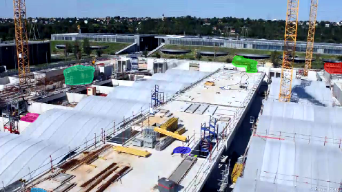

# Train an image segmentation model for vertical formworks and concrete pumps using UNet

This guide explains how to train your **Chronsite image segmentation model** with the UNet architecture and EfficientNet backbone. Our implementation relies on the UNet and EfficientNet implementations available through the `segmentation-models` library, which you can find at https://github.com/qubvel/segmentation_models. 

# Default settings and methodology
## Preprocessing
We chose to train the model with an image size of 768x1024 pixels. This size is larger than some images (which we padded) and smaller than others (which we randomly cropped). We did not choose a larger size as it would have flooded our GPU memory during training, and random crops seem to be a could solution as they augment diversity in the training set (while the model still sees the entirety of images after a few epochs). 

This step was done with the Albumentations package (https://github.com/albumentations-team/albumentations). We also implemented more in-depth augmentation strategies, still using Albumentations, including :
 - horizontal flip
 - GaussianNoise
 - changes in perspective
 - blurring
 - random contrast
 - random brightness
 - change in saturation\
We applied different probabilities to these augmentations, so that the augmented images don't differ too much from the originals.

## Training
We trained our model for 10 epochs, using the EfficientNet backbone for feature detection (first stage of the UNet architecture), pre-trained with COCO weights. In order for the computer not to run out of memory (16Go RAM available on our machines), we used a batch size of 2. These settings take approximately 3 hours to run on a P100 GPU.

## Post-processing
Post-processing was quite complex. Once the model outputs a detection mask, we go through several steps in order to obtain the coordinates of the detected polygons in JSON format:

1) We threshold pixels for each class in the predicted mask\
2) We run contour detection on the 2 first channels to identify polygons\
3) we apply alpha shape triangulation to smooth them\
4) we store the polygon coordinates in a dictionary (in COCO annotation format) and save it as JSON\

# Files and use
The `unet` folder is composed of :
* a `notebooks/` folder that contains a notebook to preprocess the images, a notebook to train the model and a notebook to test it and post-process the detected masks (we also left the notebooks corresponding to our different experiments, for reference)\
* a `models/` folder that contains the weights of our trained model (.h5 format)
* an `app/` folder that contains a webapp prototype to test the model

You can train the model end-to-end with the notebook `train_model_final.ipynb` - just take care to rename the folder paths in the first cells. To test it, you can use the *app*, which was built with `Flask` and serves the model through a user-friendly interface. To launch the app, just run the python script `app.py` (in the `app/` folder) from the command line. You can apply the model to any image, and detection results will be stored in the `inference/` sub-folder. A video demo is stored in the `app/` folder.

# Detection Example
This is the kind of visualisation you can get by running our UNet on an unseen image through the app interface:

